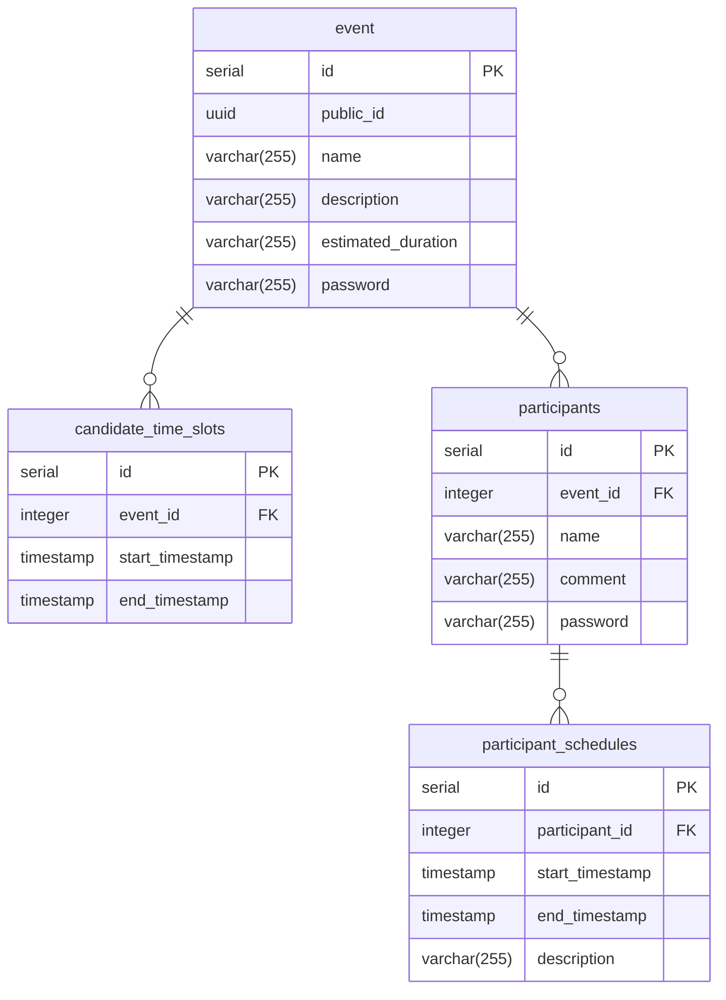

```mermaid
erDiagram
  event ||--o{ candidate_time_slots : ""
  event ||--o{ participants : ""
  participants ||--o{ participant_schedules : ""

  event {
    serial id PK
    uuid public_id
    varchar(255) name
    varchar(255) description
    varchar(255) estimated_duration
    varchar(255) password
  }

  candidate_time_slots {
    serial id PK
    integer event_id FK
    timestamp start_timestamp
    timestamp end_timestamp
  }

  participants {
    serial id PK
    integer event_id FK
    varchar(255) name
    varchar(255) comment
    varchar(255) password
  }

  participant_schedules {
    serial id PK
    integer participant_id FK
    timestamp start_timestamp
    timestamp end_timestamp
    varchar(255) description
  }
```
